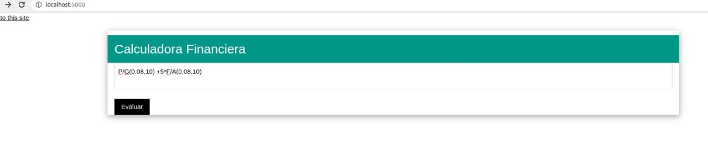

# Calculadora financiera

Calculadora de factores financieros basicos.

## Funciones


**A/F(tasa: real, n: entero)**  --> A/F dada una tasa y el numero de periodos

ejemplo: ```A/F(0.08, 10)```

**F/A(tasa: real, n: entero)**  --> F/A dada una tasa y el numero de periodos
ejemplo: ```F/A(0.08, 10)```

**A/P(tasa: real, n: entero)**  --> A/P dada una tasa y el numero de periodos
ejemplo: ```A/P(0.08, 10)```

**P/A(tasa: real, n: entero)**  --> P/A dada una tasa y el numero de periodos
ejemplo: ```P/A(0.08, 10)```

**P/G(tasa: real, n: entero)**  --> P/G dada una tasa y el numero de periodos
ejemplo: ```P/G(0.08, 10)```

**A/G(tasa: real, n: entero)**  --> A/G dada una tasa y el numero de periodos
ejemplo: ```A/G(0.08, 10)```

*utilize solo mayusculas*


## Deployment

```
git clone https://github.com/JosDuran/calcfiananzas.git
python3 -m venv unentor
source unentor/bin/activate
pip3 install -r requirements.txt
flask run
```
## Screenshoot


